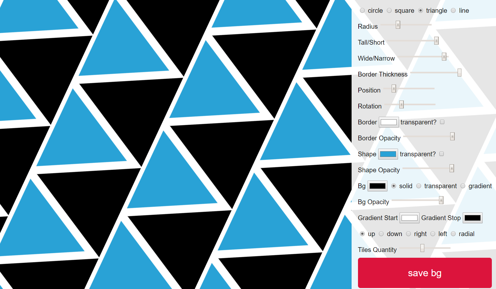

[Live Demo of the App](https://mspanish.github.io/backgrounder)

This is a work in progress, some elements go blank until you alter the settings. Ideally they should all be the same size when you switch the radio buttons. Gradients are only partially working. Also, there is a system to save any design (json, svg, and data uri) to a local DB, but I don't have a system for loading or viewing the saved entries yet.

You can create a huge amount of variations by playing around with the settings - but it does remind me a little of some of the particle generators; it isn't always easy to know how to get to a super cool design. I hope to improve that - and also to have a small gallery of presets you can view and load, so it's easier to see what you can do.

I converted this from the Codepen mentioned below to the awesome [SVG.js](http://svgjs.com/), adding features like gradients, different shapes, opacity, and more.

I made this as part of a much larger SVG project called Kwippe (https://kwippe.com) = and unfortunately I've already rewritten that version of this script and won't have a lot of time to work on this repo - but here are some ideas you may like to think about for the project:

1. viewing and loading saved bgs
2. ability to export and import JSON for bgs (already being saved)
3. more precision the the controls with better base values and more logical relationship between stated control and what actually happens! I threw this together very quickly :)
4. additional shape patterns
5. the ability to import an external svg for a pattern definition
6. PNG export - so people looking for a quick BG for a website or game can get what they need
7. CSS export, snippet to embed in your site to use the background

This project was based on a lovely Codepen by Dudley Storey [@dudleystorey](https://twitter.com/dudleystorey) and can be found [here](http://codepen.io/mspanish/pen/WOmgQr). It draws the circles in a different, overlapping fashion - and can be used to generate some really cool patterns. You can also check out the Dudley's [blog post about this here](http://thenewcode.com/336/Dynamic-SVG-Background-Pattern-Maker).

