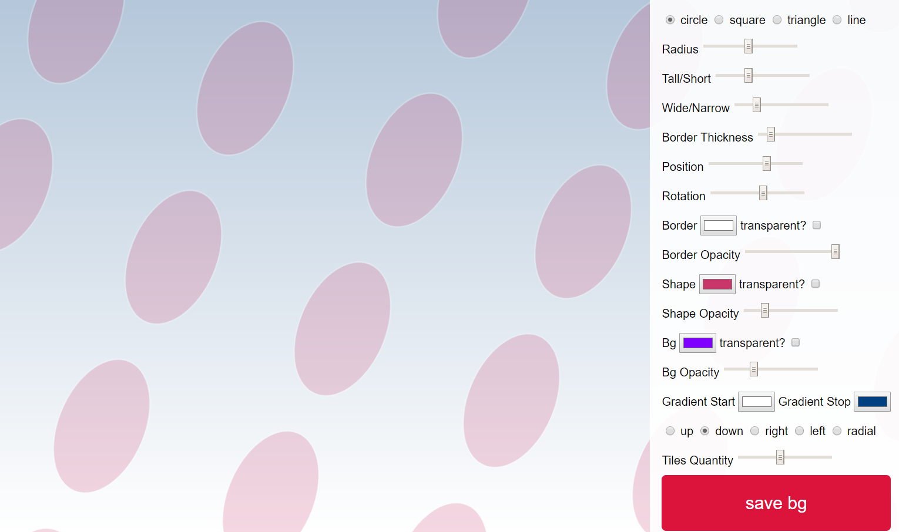

This is a work in progress, some elements go blank until you alter the settings. Ideally they should all be the same size when you switch the radio buttons. Gradients are only partially working. Also, there is a system to save any design (json, svg, and data uri) to a local DB, but I don't have a system for loading or viewing the saved entries yet.

Converted to SVG.js, with features like gradients, different shapes, and more added.

The original Codepen this project is based on can be found here - it draws the circles in a different, overlapping fashion - and can be used to generate some really [cool patterns:] (http://codepen.io/mspanish/pen/WOmgQr). You can also check out the Dudley Storey's [blog post about this here](http://thenewcode.com/336/Dynamic-SVG-Background-Pattern-Maker).